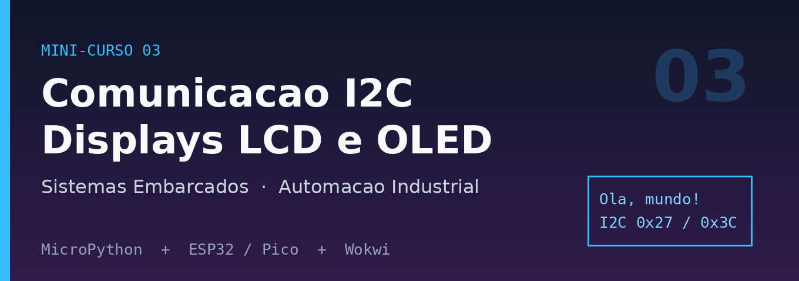

# Mini-curso 03 — Comunicação I2C: Displays LCD e OLED

> **Sistemas Embarcados** · Curso Técnico em Automação Industrial
> MicroPython · ESP32 (principal) / Raspberry Pi Pico (secundário) · Simulador Wokwi

Neste mini-curso você aprende a usar o barramento **I2C** para conectar
**displays** ao ESP32: primeiro o clássico **LCD 16x2** e depois o
**OLED SSD1306**. Esses displays serão a "tela" dos seus projetos de
comunicação UART entre dois ESP32 (próximo mini-curso).

## 📚 Aulas

| # | Aula | O que você aprende |
|---|------|--------------------|
| 1 | [O que é I2C e como varrer o barramento](aulas/aula01-i2c-scan.md) | SDA, SCL, endereços, `i2c.scan()` |
| 2 | [LCD 16x2 — primeiros caracteres](aulas/aula02-lcd-hello.md) | Backpack PCF8574, bibliotecas, "Hello World" |
| 3 | [LCD 16x2 — posição e valores dinâmicos](aulas/aula03-lcd-dinamico.md) | Cursor, linhas, contador ao vivo |
| 4 | [LCD 16x2 — caracteres customizados](aulas/aula04-lcd-custom.md) | Matriz 5×8, máscara de bits (retoma o curso 1!) |
| 5 | [OLED SSD1306 — primeiros pixels](aulas/aula05-oled-text.md) | Framebuffer, `text()`, `show()` |
| 6 | [OLED — formas e barra de progresso](aulas/aula06-oled-graficos.md) | `pixel()`, `line()`, `rect()`, `fill_rect()` |

## 🔧 Como usar

1. Abra o [Wokwi](https://wokwi.com/) e crie um projeto **MicroPython + ESP32**.
2. Em cada aula, copie o `diagram.json` e o `main.py` indicados.
3. Adicione as bibliotecas (`.py`) listadas na aula, quando houver.
4. Clique em ▶ para simular.

> ⚠️ **Professores:** todo `diagram.json` deve ser **validado antes de publicar** —
> a geração automática às vezes deixa conexões faltando.

## 📦 Bibliotecas usadas

- **LCD 16x2:** `lcd_api.py` + `i2c_lcd.py` (incluídas em `assets/libs/`)
- **OLED SSD1306:** `ssd1306.py` (incluída em `assets/libs/`) — adicione ao projeto Wokwi.

## 🚀 Publicação

Veja [`COMO-PUBLICAR.md`](COMO-PUBLICAR.md) para hospedar no GitHub Pages.
